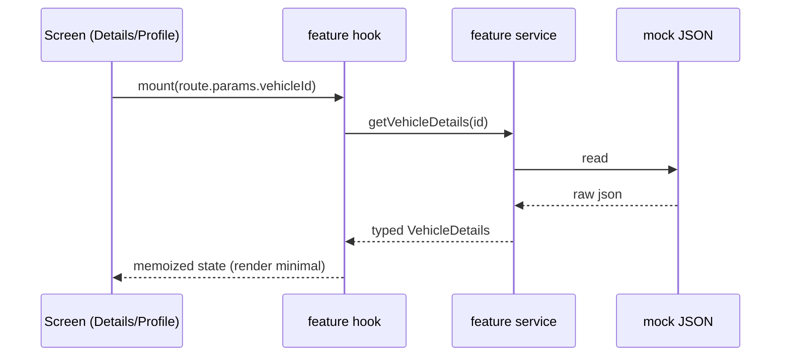

# ConnexisTracker — Project Guide

Bare **React Native CLI** (Hermes) vehicle-tracking app. UI pixel specs: [`ui-baseline/baseline_record.json`](../ui-baseline/baseline_record.json) + 16 frozen PNGs. Compare at 390×844dp (device 780×1688 @2x), exclude right-edge stride artifact (x ≥ 374).

**Legend (sab diagrams me yehi shapes/colors):** 🟦 navigation • 🟩 UI component • 🟧 data/service • 🟪 native/config • 🟫 theme
Shapes: rectangle = screen/component • stadium(rounded) = hook • cylinder = service/mock • diamond = decision • hexagon = native/config • parallelogram = user event • ❄ = frozen value (change mana hai)

---

## S0 — AI-Agent Quick Context (sirf ye box parh ke kaam shuru kren)

1. Stack: bare React Native CLI + Hermes; TypeScript; no Expo.
2. Architecture: feature-first — `src/features/<name>/{screens,components,hooks,services,types,mocks}` + `src/shared/*`.
3. Aliases: `@shared/*`, `@features/*`, `@navigation/*` ([babel.config.js](../babel.config.js) + [tsconfig.json](../tsconfig.json) — hamesha dono sath).
4. Entry: `index.js → App.tsx → RootNavigator (fori mount) + SplashOverlay (fade on onReady ∧ ≥2400ms)`.
5. Navigation: 5 bottom tabs (custom BottomNav); stacks `headerShown:false`; screens shared `AppHeader`; Profile tab me tab bar hidden.
6. Styling: tokens `src/shared/theme/*` → per-component `styles.ts` (StyleSheet.create); JSX me static inline styles BAN; hex sirf theme me.
7. Standing contracts: **UI-FREEZE** (approved screens: Details, Profile — values/geometry ❄) + **Performance Contract G1–G10** (S8).
8. Baselines: `ui-baseline/` (16 PNG + SHA-256 json); har visual task ke baad overlay = zero diff.
9. Data: screens → feature hook → feature service → mock JSON (API-ready signatures).
10. Docs rule: koi bhi naya screen/alias/token/native change = dono doc files usi task me update.

---

## S1 — Boot & Splash Flow

```mermaid
flowchart TD
  A[[index.js — AppRegistry]] --> B[App.tsx]
  B --> C[RootNavigator — mounts IMMEDIATELY, once]:::nav
  B --> D[SplashOverlay — absoluteFill, zIndex 1000, bg #F8F3F3]:::ui
  D --> E{onReady fired AND elapsed ≥ 2400ms?}:::dec
  C --> E
  E -->|yes| F[/fade 1→0, 300ms, useNativeDriver:true/]:::ev
  F --> G[overlay unmount — splashGone]:::ui
  H[[styles.xml + colors.xml — windowBackground #F8F3F3]]:::nat -. safety net .-> B
  classDef nav fill:#E3F2FD,stroke:#1E88E5; classDef ui fill:#E8F5E9,stroke:#43A047; classDef dec fill:#FFF3E0,stroke:#FB8C00; classDef ev fill:#F3E5F5,stroke:#8E24AA; classDef nat fill:#EDE7F6,stroke:#8E24AA;
```

<details><summary>ASCII fallback</summary>

```
index.js (AppRegistry)
  └─> App.tsx
        ├─ RootNavigator mounts IMMEDIATELY on first frame (exactly once, never remounts)
        └─ SplashOverlay (absolute-fill, zIndex 1000, bg colors.splash #F8F3F3) ON TOP
             ├─ logo spring + 800ms fade (useNativeDriver: true)
             ├─ dismiss: NavigationContainer.onReady fired AND >= 2400ms elapsed
             ├─ fade 1 -> 0 over 300ms, then overlay unmounts (splashGone)
             └─ native safety net: android:windowBackground=@color/splashBackground
Cold start: cream splash → 300ms fade → Home painted. NO black flash.
```
</details>

> **Source of truth:** `colors.splash='#F8F3F3'` in [`src/shared/theme/colors.ts`](../src/shared/theme/colors.ts) must equal `<color name="splashBackground">#F8F3F3</color>` in [`android/.../values/colors.xml`](../android/app/src/main/res/values/colors.xml). Native XML change = full rebuild (`npx react-native run-android`), Metro reload NOT enough.

---

## S2 — Navigation Map

```mermaid
graph TD
  RT[RootNavigator — 5 tabs, custom BottomNav]:::nav
  RT --> HS[HomeStack]:::nav
  RT --> MS[MapStack]:::nav
  RT --> RS[ReportStack — shell]:::nav
  RT --> ES[EngineControlStack — shell]:::nav
  RT --> PS[ProfileStack — tab bar hidden]:::nav
  HS --> H[HomeScreen — placeholder]:::ui
  H --> D[DetailsScreen ✅ frozen]:::ui
  MS --> LM[LiveMapScreen — shell]:::ui
  LM --> HI[HistoryScreen — shell]:::ui
  HI --> RE[ReportsScreen — shell]:::ui
  PS --> P[ProfileScreen ✅ frozen]:::ui
  D -. goToLiveMap(vehicleId) .-> LM
  classDef nav fill:#E3F2FD,stroke:#1E88E5; classDef ui fill:#E8F5E9,stroke:#43A047;
```

| Screen | Route / Params | Reached from | File | Status |
|---|---|---|---|---|
| Details | Details / vehicleId | Home card tap | [DetailsScreen.tsx](../src/features/home/screens/DetailsScreen/DetailsScreen.tsx) | ✅ frozen ❄ |
| Profile | Profile / — | Profile tab | [ProfileScreen.tsx](../src/features/profile/screens/ProfileScreen/ProfileScreen.tsx) | ✅ frozen ❄ |
| Home | Home / — | Home tab | [HomeScreen/](../src/features/home/screens/HomeScreen) | 🚧 placeholder |
| LiveMap / History / Reports | vehicleId | Map tab / View History / View Live | [features/map/](../src/features/map), [features/reports/](../src/features/reports) | 🐚 shells |

Types: [`src/navigation/types.ts`](../src/navigation/types.ts) • Stacks: [`src/navigation/stacks/`](../src/navigation/stacks) • Root: [`RootNavigator.tsx`](../src/navigation/RootNavigator.tsx) (accepts `onReady` → NavigationContainer.onReady).

---

## S3 — Screen Visual Hierarchy (❄ = frozen)

### DetailsScreen (header ScrollView ke **BAHAR** = fixed/sticky on scroll)

```
DetailsScreen
├─ AppHeader [gradient #A0340E→#7A1507→#55100A, inset+56, back+title+avatar] ❄  ← OUTSIDE ScrollView
├─ ScrollView
│   ├─ PlateStatusRow [59/41, h44, black #0F0F0F / green #5FCC00 + check] ❄
│   ├─ VehicleInfoCard
│   │   ├─ car image 115×68 @ (14,27), face RIGHT ❄
│   │   ├─ right column @56%: speed 1-line / update 2-line "(08:25 AM)" / Live Location btn (top=cyan top) ❄
│   │   └─ CyanLocationBox [56% width, 3-line body, card ke neeche 27pt hang, z above card] ❄
│   ├─ KpiRow [3 cards, top = cyan bottom + 18] ❄
│   ├─ SensorBlock ×2 [header h40 + flush Select dropdown; 6 tiles; banner] ❄
│   ├─ RoutesCard [collapsible; badges 1 green/2 amber/3 red; View More] ❄
│   ├─ QuickReportGrid [collapsible; 6 colored tiles] ❄
│   └─ OverallActivity [tabs; donut 84d/stroke19 gap-first fill; dot offset 18° into gap, 3-4pt clearance] ❄
└─ BottomNav [h56, active red #E03131 tile] ❄
```

### ProfileScreen (no tab bar; KeyboardAvoidingView; header OUTSIDE scroll content)

```
ProfileScreen
├─ AppHeader [gradient rust→black, inset+100, title center inset+60 via contentCenterOffset=32] ❄
├─ ProfileAvatar [80dp, overlap 10dp ON TOP of gradient (zIndex above header)] ❄
├─ form card [marginH 35, top=avatar bottom+15; 5 fields; dividers #DDE1E4 marginH 10 after rows 1-4] ❄
├─ UPDATE PROFILE btn [marginH 42, h52, marginTop 32, r2, #CD0716] ❄
─ LOGOUT text btn [marginTop 40, muted red] ❄
```

> **Freeze rule:** ❄ values change karne se pehle user approval + naya baseline capture zaroori hai; warn task complete nahi.

---

## S4 — Folder Map

| Path | Zimmedari / yahan change karo jab… |
|---|---|
| [src/navigation/](../src/navigation) | tabs/stacks/params; naya route ya tab |
| [shared/components/layout/](../src/shared/components/layout) | AppHeader (height/offset props), BottomNav tab bar |
| [shared/components/vehicle/](../src/shared/components/vehicle) | PlateStatusRow, VehicleInfoCard, CyanLocationBox, VehicleChip |
| [shared/components/controls/](../src/shared/components/controls) | Collapsible, SelectField, DateRangeCalendar/HourMinPicker (stubs) |
| [shared/theme/](../src/shared/theme) | colors/spacing/sizes/radii/typography/shadows + profile.ts — HAR color/size |
| [shared/hooks/](../src/shared/hooks) | useCollapsible, useDonutProgress |
| [shared/utils/](../src/shared/utils) | styleFactories (dynamic styles), format, navigationHelpers (goToLiveMap) |
| [features/home/](../src/features/home) | Home+Details screens, KpiRow/SensorBlock/RoutesCard/QuickReportGrid/OverallActivity, vehicleService, mocks |
| [features/profile/](../src/features/profile) | Profile screen + ProfileHeader/Avatar/FormField/Actions, profileService, mock |
| [features/map/](../src/features/map) • [features/reports/](../src/features/reports) | LiveMap/History/Reports shells + services (pending designs) |
| [android res values/](../android/app/src/main/res/values/styles.xml) | windowBackground, native colors — change = rebuild |
| [ui-baseline/](../ui-baseline) | 16 frozen PNGs + baseline_record.json (SHA-256) |

---

## S5 — What To Change Where

| Task | File(s) | Example |
|---|---|---|
| Color change | [theme/colors.ts](../src/shared/theme/colors.ts) | status.running |
| Spacing / heights | [spacing.ts](../src/shared/theme/spacing.ts) / [sizes.ts](../src/shared/theme/sizes.ts) | sizes.plateRowH 44 |
| Radius / shadow | [radii.ts](../src/shared/theme/radii.ts) / [shadows.ts](../src/shared/theme/shadows.ts) | radii.card 8 |
| Header height / title offset | [AppHeader.tsx](../src/shared/components/layout/AppHeader/AppHeader.tsx) props | contentHeight 100, contentCenterOffset 32 (Profile) |
| Splash color | [colors.ts](../src/shared/theme/colors.ts) + [colors.xml](../android/app/src/main/res/values/colors.xml) (donon!) | #F8F3F3 |
| Details text/data | [features/home/mocks/](../src/features/home/mocks) | location string |
| Profile fields/data | [features/profile/](../src/features/profile) (mock + FormField) | phone value |
| Card layout | component .tsx + uska styles.ts | VehicleInfoCard/ |
| Donut behavior | [useDonutProgress.ts](../src/shared/hooks/useDonutProgress.ts) + OverallActivity/ | sweep = score×3.6 |
| Collapse behavior | [useCollapsible.ts](../src/shared/hooks/useCollapsible.ts) + Collapsible/ | 250ms height+opacity |
| Aliases | [babel.config.js](../babel.config.js) + [tsconfig.json](../tsconfig.json) (sath!) | @shared/* |
| Sticky/fixed header structure | screen .tsx (header ScrollView ke bahar) | DetailsScreen.tsx |
| Baselines re-capture | [ui-baseline/](../ui-baseline) | 16 PNG + json hashes |

---

## S6 — Data Flow



Rule: screens kabhi direct mock import NAHIN kartin — hook → service → mock (future: HTTP API).

---

## S7 — Styling System

```
theme tokens (colors/spacing/sizes/radii/typography/shadows)
   └─> components/<Name>/styles.ts  →  StyleSheet.create (module scope)
         └─> JSX: style={styles.x}   | dynamic: [styles.base, styleFactories.foo(props)]
```

- BAN: static inline `style={{...}}` in JSX.
- BAN: hex / magic numbers outside `shared/theme`.
- BAN: legacy identifiers `C, SZ, R, FS` / `detailsTokens`.

```tsx
// WRONG                          // RIGHT
<View style={{marginTop: 32}}>    <View style={styles.logoutWrap}>   // styles.ts: marginTop: spacing.xl + 8
```

---

## S8 — Performance Contract (G1–G10, har task pe लागू)

| # | Rule | Verify kaise |
|---|---|---|
| G1 | Hermes ON; no heavy deps | gradle hermesEnabled; dep review |
| G2 | memo/useCallback/useMemo; no inline funcs/objects in JSX; stable keys | review + profiler |
| G3 | >10 rows = FlatList/SectionList (virtualized props) | grep ScrollView+map |
| G4 | StyleSheet.create module-scope; precomputed combos | grep static style={{ |
| G5 | useNativeDriver:true (transform/opacity); layout anims short/isolated | grep useNativeDriver:false |
| G6 | require() + explicit w/h + resizeMethod | image audit |
| G7 | no render-time heavy work; zero console.log; lazy services | grep console. |
| G8 | thin App.tsx; lazy screens where supported | startup compare |
| G9 | split static contexts; ids via params | review |
| G10 | Gates: idle re-renders 0; scroll smooth; grep gates clean | profiler + table below |

| Gate | Target |
|---|---|
| Home/Details/Profile idle re-renders after settle | 0 |
| `console.*` in src/ | 0 |
| Static inline styles in new/patched code | 0 |

---

## S9 — Debugging Guide

```bash
npx react-native start --reset-cache     # Metro + cache clear
npm run android                          # build+launch (native changes ke liye zaroori)
adb reverse tcp:8081 tcp:8081            # device -> Metro
adb logcat | grep ReactNativeJS          # JS logs
adb exec-out screencap -p > shot.png     # baseline-compare screenshot
# Windows: Task Manager -> node.exe kill  # stale Metro
```

| Red-screen type | Pehchan | Fix order |
|---|---|---|
| UnableToResolveError | "could not be found within the project" | 1 alias babel+tsconfig 2 extensions [.ts,.tsx,…] 3 root double-path check 4 --reset-cache |
| Runtime TypeError | stack trace; pehli app-file line apni hai | file:line kholo → recent change → guard/fix → reload |
| Yellow warning | non-fatal | deprecated prop/API update; ignore if documented |

**5-step routine:** 1 error header parho → 2 file:line kholo → 3 aakhri change yaad karo → 4 reset-cache restart → 5 logs ke sath reproduce.

> **Case study — black flash after splash:** cause = splash unmount → 1-5 frame gap (5-stack init) → Android default black windowBackground. Fix = RootNavigator fori mount + SplashOverlay fade on `onReady ∧ ≥2400ms` + `windowBackground=#F8F3F3`. Detail: S1.

> **UI-FREEZE overlay procedure:** 390×844dp capture → `/ui-baseline/` PNGs se overlay (x ≥ 374 stride exclude) → zero diff = pass; warn = task complete nahi.

---

## S10 — Glossary

| Term | Meaning |
|---|---|
| Metro | RN ka bundler/dev-server; red-screens isi ki hoti hain |
| Babel + module-resolver | compile-time alias rewrite (@shared/... → relative path) |
| Tab vs Stack | Tab = parallel roots (bottom bar); Stack = push/pop screens |
| Hook | state/logic reuse (useCollapsible, useDonutProgress, useVehicleDetails) |
| Service | data layer (mock today, API kal); screens direct mock nahi parhti |
| Token | theme constant (color/size/spacing) — single source of truth |
| React.memo / useCallback | re-render rokne ke tools (G2) |
| onReady | NavigationContainer ka "navigator tayyar" event — splash isi pe fade karta hai |
| windowBackground | Android native window color jo RN paint se pehle dikhta hai |
| zIndex / elevation | paint order (iOS / Android) — avatar-over-header isi se hai |

---

## S11 — Doc Maintenance

Naya screen / alias / token / native change = **donon** doc files (HTML + MD) usi task me update. Footer har update pe refresh hota hai.

*Last verified: 2026-09-17 • verified paths: 40+ • baselines: 16 PNG + json • Mirror: `docs/PROJECT_GUIDE.html` (same content, Mermaid CDN + ASCII fallbacks).*