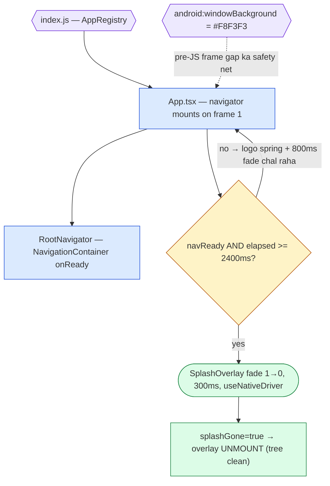
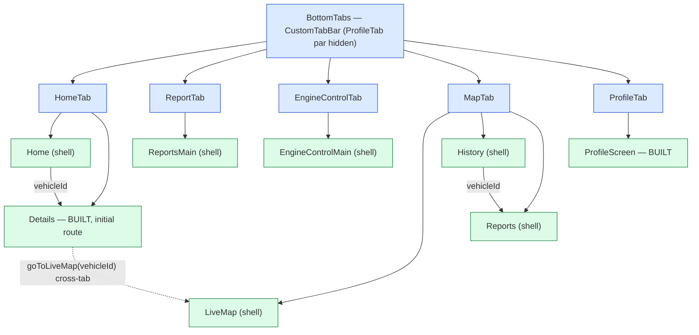
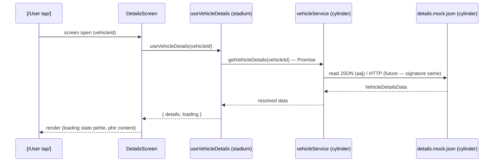
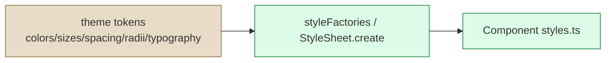

# ConnexisTracker — Project Guide

Bare **React Native CLI** vehicle-tracking app. Yeh guide repo ke **current state** se generate hui hai — har path, route aur command jo yahan likha hai wo aaj disk par mojood hai.

---

## S0 — How to Use + AI-Agent Quick Context

> **AI AGENTS: sirf yeh box parh kar kaam shuru kar sakte ho.**

| # | Fact | Value |
|---|------|-------|
| 1 | Stack | Bare RN CLI (**Expo nahi**) — `react-native@0.87.1`, React 19, Hermes, TypeScript strict — [package.json](../package.json) |
| 2 | Architecture | **Feature-first**: `src/features/<name>/{screens,components,hooks,services,mocks,types}` + cross-cutting `src/shared/` |
| 3 | Path aliases | `@shared/*` → `src/shared/*`, `@features/*` → `src/features/*`, `@navigation/*` → `src/navigation/*` — [babel.config.js](../babel.config.js) + [tsconfig.json](../tsconfig.json) (dono saath update karo) |
| 4 | Entry chain | [index.js](../index.js) → [App.tsx](../App.tsx) (navigator mounts immediately + splash overlay) → [RootNavigator.tsx](../src/navigation/RootNavigator.tsx) → 5 tabs |
| 5 | UI-FREEZE | Approved screens (Details, Profile) pixel-frozen. Geometry/colors change karne se pehle S3 dekho; baselines `/ui-baseline/` |
| 6 | Perf contract | **G1–G10** global performance contract — S8 checklist; gates: `tsc`, `eslint --quiet`, `jest`, grep (`console.*` = 0, inline `style={{` = 0) |
| 7 | Baselines | `/ui-baseline/` — 16 PNGs + [baseline_record.json](../ui-baseline/baseline_record.json) (SHA-256 per crop + interaction notes). Naya visual change = naya baseline |
| 8 | Splash/window | `colors.splash = '#F8F3F3'` JS + native `windowBackground` — **dono match hone chahiye** |
| 9 | Header gradient | Shared `colors.gradientHeader = ['#B2250C','#160F12']` (LinearGradient vertical, Figma-exact) — Details + Profile same header |
| 10 | Docs sync rule | Koi bhi naya screen/alias/token/native change → **yeh dono files (MD+HTML) usi task me update karo** (S11) |

**Shape legend (har diagram me same):** rectangle = screen/component · stadium = hook · cylinder = service/mock/data · diamond = decision/condition · hexagon = native/config file · parallelogram = user action/event.
**Color code:** navigation = blue · UI components = green · data/services = orange · native/config = purple · theme = tan.

---

## S1 — Boot & Splash Flow



**ASCII fallback**

```
[index.js]  (native entry, AppRegistry)
    |
    v
[App.tsx]  -- mounts immediately -->  [RootNavigator(onReady)] --> 5 tabs
    |                                        ^
    |  SplashOverlay (#F8F3F3, zIndex 1000)  |
    |  ON TOP of navigator                   |
    v                                        |
{navReady && elapsed>=2400ms?} --yes--> ((fade 300ms, native driver)) --> [overlay unmount]
    | no
    +--> logo spring + 800ms tagline fade continues

safety net: android:windowBackground=#F8F3F3 (native window cream before first JS paint)
```

Files: [index.js](../index.js) · [App.tsx](../App.tsx) · [RootNavigator.tsx](../src/navigation/RootNavigator.tsx) · [styles.xml](../android/app/src/main/res/values/styles.xml) · [colors.xml](../android/app/src/main/res/values/colors.xml) · `colors.splash` in [colors.ts](../src/shared/theme/colors.ts).
**Note:** native XML change = full rebuild (`npx react-native run-android`) — Metro reload se apply **nahi** hota.

---

## S2 — Navigation Map



**ASCII fallback**

```
[BottomTabs]
 |- HomeTab --------> [Home (shell)] --vehicleId--> [Details *BUILT, initial route]
 |                                                        | cross-tab goToLiveMap(vehicleId)
 |- ReportTab --------> [ReportsMain (shell)] <--------------------------------+
 |- EngineControlTab --> [EngineControlMain (shell)]
 |- MapTab ------> [LiveMap (shell)]   [History (shell)] --vehicleId--> [Reports (shell)]
 |- ProfileTab -------> [ProfileScreen *BUILT]   (tab bar hidden on this tab)
```

| Screen | Route name | Params | Reached from | File | Status |
|---|---|---|---|---|---|
| Home | `HomeTab > Home` | — | Tab bar | [HomeScreen/index.tsx](../src/features/home/screens/HomeScreen/index.tsx) | shell |
| Details | `HomeTab > Details` | `vehicleId?: string` | Home list + **HomeStack initial route** | [DetailsScreen/DetailsScreen.tsx](../src/features/home/screens/DetailsScreen/DetailsScreen.tsx) | **built** |
| LiveMap | `MapTab > LiveMap` | `vehicleId?: string` | Tab bar, `goToLiveMap()` cross-tab | [LiveMapScreen/index.tsx](../src/features/map/screens/LiveMapScreen/index.tsx) | shell |
| History | `MapTab > History` | `vehicleId: string` | LiveMap | [HistoryScreen/index.tsx](../src/features/map/screens/HistoryScreen/index.tsx) | shell |
| Reports (map) | `MapTab > Reports` | `vehicleId?: string` | History | [ReportsScreen/index.tsx](../src/features/reports/screens/ReportsScreen/index.tsx) | shell |
| Reports (tab) | `ReportTab > ReportsMain` | — | Tab bar | [ReportsScreen/index.tsx](../src/features/reports/screens/ReportsScreen/index.tsx) | shell |
| EngineControl | `EngineControlTab > EngineControlMain` | — | Tab bar | [EngineControlScreen/index.tsx](../src/features/engineControl/screens/EngineControlScreen/index.tsx) | shell |
| Profile | `ProfileTab > ProfileMain` | — | Tab bar | [ProfileScreen/ProfileScreen.tsx](../src/features/profile/screens/ProfileScreen/ProfileScreen.tsx) | **built** |

Stack files: [HomeStack.tsx](../src/navigation/stacks/HomeStack.tsx) · [MapStack.tsx](../src/navigation/stacks/MapStack.tsx) · [ReportStack.tsx](../src/navigation/stacks/ReportStack.tsx) · [EngineControlStack.tsx](../src/navigation/stacks/EngineControlStack.tsx) · [ProfileStack.tsx](../src/navigation/stacks/ProfileStack.tsx) · params [types.ts](../src/navigation/types.ts) · cross-tab helper [navigationHelpers.ts](../src/shared/utils/navigationHelpers.ts).

**Example:** Details kholna → `navigation.navigate('HomeTab', { screen: 'Details', params: { vehicleId: 'V-001' } })`. Cross-tab map → `goToLiveMap(navigation, vehicleId)`.

---

## S3 — Screen Visual Hierarchy (BUILT screens)

### 3.1 Details (UI-FROZEN ❄)

Component tree (parent → children), nodes files se linked:

- [DetailsScreen/DetailsScreen.tsx](../src/features/home/screens/DetailsScreen/DetailsScreen.tsx) + [styles.ts](../src/features/home/screens/DetailsScreen/styles.ts)
  - [AppHeader.tsx](../src/shared/components/layout/AppHeader/AppHeader.tsx) — **fixed, ScrollView ke BAHAR**; LinearGradient [#B2250C→#160F12 vertical, Figma-exact] ❄
  - `ScrollView` (content fixed header ke neeche slide karti hai)
    - [PlateStatusRow](../src/shared/components/vehicle/PlateStatusRow/PlateStatusRow.tsx) + [styles](../src/shared/components/vehicle/PlateStatusRow/styles.ts) — black 59% / green 41% ❄
    - [VehicleInfoCard](../src/shared/components/vehicle/VehicleInfoCard/VehicleInfoCard.tsx) + [styles](../src/shared/components/vehicle/VehicleInfoCard/styles.ts)
      - car image 115×68 ❄ · [CyanLocationBox](../src/shared/components/vehicle/CyanLocationBox/CyanLocationBox.tsx) — cyan 56% width, card ke NEECHE hang ❄
      - right col 55%: speed/update rows + Live Location button (h=30) ❄
    - [KpiRow](../src/features/home/components/KpiRow/KpiRow.tsx) + [styles](../src/features/home/components/KpiRow/styles.ts) — cards h=62 ❄
    - [SensorBlock](../src/features/home/components/SensorBlock/SensorBlock.tsx) + [styles](../src/features/home/components/SensorBlock/styles.ts) — [useCollapsible](../src/shared/hooks/useCollapsible.ts) (250ms) ❄
    - [RoutesCard](../src/features/home/components/RoutesCard/RoutesCard.tsx) + [styles](../src/features/home/components/RoutesCard/styles.ts) — [useDonutProgress](../src/shared/hooks/useDonutProgress.ts) donut d=84, stroke 18.5 ❄
    - [QuickReportGrid](../src/features/home/components/QuickReportGrid/QuickReportGrid.tsx) + [styles](../src/features/home/components/QuickReportGrid/styles.ts)
    - [OverallActivity](../src/features/home/components/OverallActivity/OverallActivity.tsx) + [styles](../src/features/home/components/OverallActivity/styles.ts)
  - [BottomNav.tsx](../src/shared/components/layout/BottomNav/BottomNav.tsx) — h=56 ❄ (via [RootNavigator](../src/navigation/RootNavigator.tsx))

Geometry cheat-table (source: [sizes.ts](../src/shared/theme/sizes.ts) + baselines):

| Value | Measured | Example | File |
|---|---|---|---|
| Header total ❄ | safeAreaInset + 56 (`contentHeight` default = `sizes.appBar`) | inset 24 → 80dp | [AppHeader.tsx](../src/shared/components/layout/AppHeader/AppHeader.tsx) |
| Plate row ❄ | h=44, split 59/41 (black left / green right) | [details_plateRow.png](../ui-baseline/details_plateRow.png) | [PlateStatusRow/styles.ts](../src/shared/components/vehicle/PlateStatusRow/styles.ts) |
| Cyan overlay ❄ | 56% card width, card ke NEECHE ~1/3 hang | [details_vehicleCard_cyanOverlay.png](../ui-baseline/details_vehicleCard_cyanOverlay.png) | [CyanLocationBox/styles.ts](../src/shared/components/vehicle/CyanLocationBox/styles.ts) |
| Card bottom ❄ | content ke baad 23dp (`cardBottomPad`) | same crop as above | [sizes.ts](../src/shared/theme/sizes.ts) |
| Donut ❄ | d=84, stroke 18.5, dot 16 | [details_routesExpanded.png](../ui-baseline/details_routesExpanded.png) | [useDonutProgress.ts](../src/shared/hooks/useDonutProgress.ts) |
| BottomNav ❄ | h=56 | [details_bottomNav.png](../ui-baseline/details_bottomNav.png) | [BottomNav/styles.ts](../src/shared/components/layout/BottomNav/styles.ts) |

### 3.2 Profile (UI-FROZEN ❄)

- [ProfileScreen/ProfileScreen.tsx](../src/features/profile/screens/ProfileScreen/ProfileScreen.tsx)
  - `ScrollView` — **header ScrollView ke ANDAR** (PATCH F avatar z-order fix: header pehle paint hota hai, avatar uska next sibling)
    - [ProfileHeader.tsx](../src/features/profile/components/ProfileHeader/ProfileHeader.tsx) → shared [AppHeader.tsx](../src/shared/components/layout/AppHeader/AppHeader.tsx) — `contentHeight=100`, `contentCenterOffset=32`, `showAvatar=false` ❄
    - [ProfileAvatar](../src/features/profile/components/ProfileAvatar/ProfileAvatar.tsx) — avatar 80dp, gradient edge se **exactly 10dp overlap** ❄, circle gradient ke UPAR (tree order + zIndex)
    - [ProfileFormField](../src/features/profile/components/ProfileFormField/ProfileFormField.tsx) rows — state [useProfile](../src/features/profile/hooks/useProfile.ts) se
    - [ProfileActions](../src/features/profile/components/ProfileActions/ProfileActions.tsx) — UPDATE PROFILE button + LOGOUT
  - Tab bar hidden — [RootNavigator](../src/navigation/RootNavigator.tsx) `CustomTabBar` `ProfileTab` → `null`

Geometry cheat-table (source: [profile.ts](../src/shared/theme/profile.ts)):

| Value | Measured | Example | File |
|---|---|---|---|
| Header band ❄ | inset + 100 (`headerBar: 100`) | inset 24 → 124dp | [profile.ts](../src/shared/theme/profile.ts) |
| Title centre ❄ | inset + 60 (`headerCenterOffset: 32` + row 56/2) | ~84dp | [profile.ts](../src/shared/theme/profile.ts) |
| Avatar ❄ | 80dp, ring 1dp, radius 40, overlap 10dp | [profile_headerAvatar.png](../ui-baseline/profile_headerAvatar.png) | [profile.ts](../src/shared/theme/profile.ts) · [ProfileAvatar](../src/features/profile/components/ProfileAvatar/ProfileAvatar.tsx) |
| Button ❄ | UPDATE PROFILE h=52, marginH=42, card se 32dp neeche | [profile_button.png](../ui-baseline/profile_button.png) | [ProfileActions](../src/features/profile/components/ProfileActions/ProfileActions.tsx) |
| LOGOUT ❄ | button se 40dp neeche, text `#B05656` | [profile_logout.png](../ui-baseline/profile_logout.png) | [profile.ts](../src/shared/theme/profile.ts) |
| Gradient ❄ | **#B2250C (0%) → #160F12 (100%) vertical, Figma-exact** (LinearGradient, PATCH J1) | dono headers same token | [colors.ts `gradientHeader`](../src/shared/theme/colors.ts) · [AppHeader.tsx](../src/shared/components/layout/AppHeader/AppHeader.tsx) |

---

## S4 — Folder Map

| Path | Responsibility | Yahan change karo jab… |
|---|---|---|
| [src/features/home/](../src/features/home) | Home + Details feature | Home feed banna ho ya Details data/UI |
| [src/features/profile/](../src/features/profile) | Profile feature (form, avatar, actions) | Profile UI/behavior |
| [src/features/map/](../src/features/map) | LiveMap + History screens | Map features |
| [src/features/reports/](../src/features/reports) | Reports screen (shell; dono tabs share) | Reporting UI |
| [src/features/engineControl/](../src/features/engineControl) | Engine control screen (shell) | Engine commands |
| [src/shared/components/](../src/shared/components) | Reusable UI — [layout/](../src/shared/components/layout) (AppHeader, BottomNav), [vehicle/](../src/shared/components/vehicle), [controls/](../src/shared/components/controls), [feedback/](../src/shared/components/feedback), [icons](../src/shared/components/icons/index.tsx) | Component 2+ features use karein |
| [src/shared/hooks/](../src/shared/hooks) | [useCollapsible.ts](../src/shared/hooks/useCollapsible.ts), [useDonutProgress.ts](../src/shared/hooks/useDonutProgress.ts) | Shared animation/state behavior |
| [src/shared/theme/](../src/shared/theme) | Tokens — [colors](../src/shared/theme/colors.ts), [sizes](../src/shared/theme/sizes.ts), [spacing](../src/shared/theme/spacing.ts), [typography](../src/shared/theme/typography.ts), [radii](../src/shared/theme/radii.ts), [shadows](../src/shared/theme/shadows.ts), [profile](../src/shared/theme/profile.ts) | Koi bhi color/size/spacing/radius |
| [src/shared/utils/](../src/shared/utils) | [styleFactories.ts](../src/shared/utils/styleFactories.ts), [format.ts](../src/shared/utils/format.ts), [navigationHelpers.ts](../src/shared/utils/navigationHelpers.ts), [color.ts](../src/shared/utils/color.ts) | Duplicated style logic / formatting |
| [src/shared/types/](../src/shared/types) | [common.ts](../src/shared/types/common.ts), [vehicle.ts](../src/shared/types/vehicle.ts) | Cross-feature types |
| [src/navigation/](../src/navigation) | [RootNavigator.tsx](../src/navigation/RootNavigator.tsx), [stacks/](../src/navigation/stacks), [types.ts](../src/navigation/types.ts) | Naya tab/screen/route |
| [src/assets/](../src/assets) | logo, car images, [profile.jpeg](../src/assets/profile.jpeg), [profile_avatar.png](../src/assets/profile_avatar.png) | Static media |
| [android/.../res/values/](../android/app/src/main/res/values/styles.xml) | [styles.xml](../android/app/src/main/res/values/styles.xml) + [colors.xml](../android/app/src/main/res/values/colors.xml) — window/splash native look | **Change = full rebuild** |
| [ui-baseline/](../ui-baseline/baseline_record.json) | Frozen reference PNGs + SHA-256 record | Sirf approved visual change ke baad re-capture |
| [__tests__/](../__tests__) | Jest tests | Naya unit test |

---

## S5 — What To Change Where

| # | Task | File(s) | Notes / Example |
|---|---|---|---|
| 1 | Koi color badalna | [colors.ts](../src/shared/theme/colors.ts) | `gradientHeader`, `splash`, brand/status/surface tokens |
| 2 | Spacing / sizes | [spacing.ts](../src/shared/theme/spacing.ts) · [sizes.ts](../src/shared/theme/sizes.ts) | px values sirf yahan |
| 3 | Radius / shadows | [radii.ts](../src/shared/theme/radii.ts) · [shadows.ts](../src/shared/theme/shadows.ts) | card=4, button=2 (Profile) |
| 4 | Splash color | [colors.ts `splash`](../src/shared/theme/colors.ts) + [colors.xml](../android/app/src/main/res/values/colors.xml) | dono SAME hex; phir rebuild |
| 5 | Header gradient | [colors.ts `gradientHeader`](../src/shared/theme/colors.ts) + [AppHeader.tsx](../src/shared/components/layout/AppHeader/AppHeader.tsx) | **#B2250C→#160F12** (PATCH J1, Figma-exact, LinearGradient) |
| 6 | Header heights / title offset | [AppHeader.tsx](../src/shared/components/layout/AppHeader/AppHeader.tsx) props `contentHeight`/`contentCenterOffset` | Details=56/0, Profile=100/32 ([ProfileHeader](../src/features/profile/components/ProfileHeader/ProfileHeader.tsx)) |
| 7 | Sticky-header structure | [DetailsScreen.tsx](../src/features/home/screens/DetailsScreen/DetailsScreen.tsx) (header BAHAR) vs [ProfileScreen.tsx](../src/features/profile/screens/ProfileScreen/ProfileScreen.tsx) (header ANDAR) | Profile andar isliye: avatar z-order (PATCH F) |
| 8 | Avatar overlap / z-order | [profile.ts `avatarOverlap`](../src/shared/theme/profile.ts) + [ProfileAvatar](../src/features/profile/components/ProfileAvatar/ProfileAvatar.tsx) | 10dp ❄ |
| 9 | Details texts / data | [details.mock.json](../src/features/home/mocks/details.mock.json) + [types/details.ts](../src/features/home/types/details.ts) | UI nahi, data badalta hai |
| 10 | Card layouts (KPI/Routes/Sensor/QuickReport) | [home/components/](../src/features/home/components) | har component ka apna styles.ts |
| 11 | Icons add karna | [icons/index.tsx](../src/shared/components/icons/index.tsx) | shared icon set |
| 12 | Naya screen | naya `features/<x>/screens/...` + [stack file](../src/navigation/stacks) + [types.ts](../src/navigation/types.ts) | shell → built pattern S2 me |
| 13 | Naya tab | [RootNavigator.tsx](../src/navigation/RootNavigator.tsx) + [BottomNav.tsx](../src/shared/components/layout/BottomNav/BottomNav.tsx) (`tabs` + `tabNameToLabel`) | dono update |
| 14 | Donut behavior | [useDonutProgress.ts](../src/shared/hooks/useDonutProgress.ts) | animated progress ring |
| 15 | Collapse behavior | [useCollapsible.ts](../src/shared/hooks/useCollapsible.ts) | 250ms animated ❄ |
| 16 | Path aliases | [babel.config.js](../babel.config.js) + [tsconfig.json](../tsconfig.json) | **dono saath**, warna Metro ya TS tootega |
| 17 | windowBackground | [styles.xml](../android/app/src/main/res/values/styles.xml) + [colors.xml](../android/app/src/main/res/values/colors.xml) | `#F8F3F3` ❄; rebuild |
| 18 | Baselines re-capture | [/ui-baseline/](../ui-baseline/baseline_record.json) | naye SHA-256 likhna zaroori |

---

## S6 — Data Flow



**ASCII fallback**

```
[User tap] --> [DetailsScreen] --> (useVehicleDetails) --> [vehicleService] --> [(details.mock.json)]
                     ^                                                              |
                     |<----------- { details, loading } <--------- [resolved data]--+
Future: [(mock.json)] ki jagah [(HTTP API)] — sirf service ka body badlega, hook/screen untouched.
```

Worked examples (real code):
- Details: [DetailsScreen.tsx](../src/features/home/screens/DetailsScreen/DetailsScreen.tsx) → [useVehicleDetails.ts](../src/features/home/hooks/useVehicleDetails.ts) (`mounted` guard) → [vehicleService.ts](../src/features/home/services/vehicleService.ts) → [details.mock.json](../src/features/home/mocks/details.mock.json) / [vehicles.mock.json](../src/features/home/mocks/vehicles.mock.json)
- Profile: [ProfileScreen.tsx](../src/features/profile/screens/ProfileScreen/ProfileScreen.tsx) → [useProfile.ts](../src/features/profile/hooks/useProfile.ts) (`setField`/`save` referentially stable) → [profileService.ts](../src/features/profile/services/profileService.ts) (`getProfile` + `updateProfile` stub) → [profile.mock.json](../src/features/profile/mocks/profile.mock.json)

---

## S7 — Styling System



**ASCII fallback**

```
[colors.ts / sizes.ts / spacing.ts / radii.ts / typography.ts]   (theme = tan)
        |  tokens import
        v
(styleFactories) --> [styles.ts — StyleSheet.create] --> [component render]
```

**Teen bans (violations = PR reject):**
1. Component me **raw hex / magic number** — sirf theme token use karo ([colors.ts](../src/shared/theme/colors.ts), [sizes.ts](../src/shared/theme/sizes.ts)).
2. Naye/patched code me **static inline `style={{...}}`** — [styleFactories.ts](../src/shared/utils/styleFactories.ts) ya [styles.ts](../src/shared/components/layout/AppHeader/styles.ts) pattern use karo.
3. **`console.*` src/ me** — grep gate = 0.

**WRONG vs RIGHT:**

```tsx
// WRONG — inline static style + raw hex + magic px
<View style={{ height: 56, backgroundColor: '#EA0E0E' }} />

// RIGHT — token-driven, factory-based (AppHeader ka asli pattern)
import { makeHeightStyle } from '@shared/utils/styleFactories';
<View style={[styles.container, makeHeightStyle(insets.top + contentHeight)]} />
// styles.ts: container: { ... } — colors.gradientHeader se LinearGradient
```

Theme files: [colors.ts](../src/shared/theme/colors.ts) · [sizes.ts](../src/shared/theme/sizes.ts) · [spacing.ts](../src/shared/theme/spacing.ts) · [typography.ts](../src/shared/theme/typography.ts) · [radii.ts](../src/shared/theme/radii.ts) · [shadows.ts](../src/shared/theme/shadows.ts) · [profile.ts](../src/shared/theme/profile.ts) · [styleFactories.ts](../src/shared/utils/styleFactories.ts)

---

## S8 — Performance Contract (G1–G10 checklist)

| Rule | Contract | How to verify | File(s) |
|---|---|---|---|
| G1 | Settled screens par **idle re-renders = 0** (Home/Details/Profile) | React DevTools profiler: interact → settle → 0 commits | [DetailsScreen](../src/features/home/screens/DetailsScreen/DetailsScreen.tsx), [ProfileScreen](../src/features/profile/screens/ProfileScreen/ProfileScreen.tsx) |
| G2 | Event handlers / callbacks **referentially stable** (`useCallback`) | `setField`/`save` pattern dekho; handlers props me pass hote waqt memoized | [useProfile.ts](../src/features/profile/hooks/useProfile.ts) |
| G3 | Saari animations **`useNativeDriver: true`** | splash fade, logo spring — grep `useNativeDriver` | [App.tsx](../App.tsx) |
| G4 | Shared animation behavior **hooks me** (copy-paste nahi) | collapse 250ms, donut progress | [useCollapsible.ts](../src/shared/hooks/useCollapsible.ts), [useDonutProgress.ts](../src/shared/hooks/useDonutProgress.ts) |
| G5 | Repeated data lists **memoized rows + stable keys** (naya list = FlatList rules) | rows `memo` + `keyExtractor`; har-row state nahi | [ProfileFormField](../src/features/profile/components/ProfileFormField/ProfileFormField.tsx) pattern |
| G6 | **`console.*` in src/ = 0** | `grep -r "console." src/` → 0 matches | whole `src/` |
| G7 | Naye/patched code me **static inline styles = 0** | `grep "style={{"` naye diffs me | [styleFactories.ts](../src/shared/utils/styleFactories.ts) |
| G8 | Services **typed Promise API** — mock↔HTTP swap UI ko touch na kare | signature dekho: `getVehicleDetails(id): Promise<VehicleDetailsData>` | [vehicleService.ts](../src/features/home/services/vehicleService.ts), [profileService.ts](../src/features/profile/services/profileService.ts) |
| G9 | **Navigator mounts exactly once** — conditional remount kabhi nahi | React Profiler: single `NavigationContainer` mount, boot + tab switches | [App.tsx](../App.tsx), [RootNavigator.tsx](../src/navigation/RootNavigator.tsx) |
| G10 | Colors/layout **sirf tokens se** (single source of truth) | naya hex component me dikh jaye = fail | [theme/](../src/shared/theme) |

---

## S9 — Debugging Guide

### Commands cheat-sheet

| Command | Kab use karo | Note |
|---|---|---|
| `npm start -- --reset-cache` | Metro stale / alias changes ke baad | hidden window me chalao, log file me redirect |
| `npx react-native run-android` | native module/XML change ke baad | **full rebuild** (e.g. LinearGradient add hua) |
| `adb reverse tcp:8081 tcp:8081` | device JS bundle load nahi ho raha | device↔Metro port bridge |
| `taskkill /F /IM node.exe` | Metro hang/dead | phir fresh `npm start` |
| `adb logcat *:S ReactNativeJS:V ReactNative:V` | JS crash / red screen details | native + JS logs filter |
| `adb shell screencap -p /sdcard/s.png` | UI-FREEZE verification capture | phir `adb pull` |

### Red-screen types

| Symptom | Matlab | Fix steps |
|---|---|---|
| `Unable to resolve module "@shared/..."` | alias resolve fail | 1) [babel.config.js](../babel.config.js) alias check 2) [tsconfig.json](../tsconfig.json) paths match karo 3) `extensions` me `.tsx` hai? 4) Metro `--reset-cache` |
| `Invariant Violation: TurboModuleRegistry...` | native module link nahi hua | full rebuild: `npx react-native run-android` (Metro reload kaafi nahi) |
| Runtime `TypeError: undefined is not an object` | JS logic bug | stack trace ki **pehli apni file wali line** parhao — wahi culprit |
| Yellow warnings | deprecated API / missing key | ignore nahi karo — fix, warna perf contracts slip honge |

### 5-step debug routine

1. Error screen ka **exact pehla line** copy karo (RedBox ya logcat se).
2. Stack trace me **apni repo ki pehli file** dhundo — usi se start karo.
3. File ke docs section se link follow karo (S5 table batata hai kahan change hota hai).
4. Fix ke baad `npx tsc --noEmit` + `npx eslint src --quiet` + `npx jest` (S8 gates).
5. Agar UI change hua → S9 ka UI-FREEZE procedure (neeche).

### UI-FREEZE overlay procedure (baselines)

1. `adb shell screencap -p /sdcard/cur.png && adb pull /sdcard/cur.png` — device 780×1688 @2x = **390×844dp**, right-edge stride artifact exclude (x ≥ 374).
2. Reference se compare karo: [/ui-baseline/](../ui-baseline/baseline_record.json) — full PNG (`details_full.png`, `profile_full.png`) + relevant crop (S3 tables me linked).
3. **Pass rule:** crop ke andar 0 differing content rows (OS clock/status area allowed). Fail → geometry revert ya re-capture with record update.
4. Kisi bhi ❄ value change hui → baselines + [baseline_record.json](../ui-baseline/baseline_record.json) **usi task me** naye SHA-256 ke saath update karo.

### Case study — splash black-frame (real bug, fixed)

- **Symptom:** logo splash ke baad Home se pehle ~1-5 frames **black** screen.
- **Cause (purana code):** `setTimeout(2400)` splash ko **unmount** karta tha, phir `RootNavigator` (5-tab navigator) pehli baar mount hota — us init ke frames me screen par kuch nahi, aur Android default `windowBackground` **black** thi.
- **Fix:** (a) navigator **immediately** mount, splash absolute overlay ON TOP; (b) dismiss sirf `onReady && ≥2400ms` par, 300ms native-driver fade, phir unmount; (c) native safety net `windowBackground=#F8F3F3` — [App.tsx](../App.tsx) · [styles.xml](../android/app/src/main/res/values/styles.xml) · [colors.xml](../android/app/src/main/res/values/colors.xml).
- **Lesson:** conditional `if (ready) return <Navigator/>` pattern navigation init ke waqt blank window deta hai — overlay pattern use karo.

---

## S10 — Glossary

| Term | Roman Urdu one-liner |
|---|---|
| Metro | RN ka dev server jo JS bundle banata hai — `npm start` se chalta hai |
| Babel | JS transpiler; naye syntax ko RN samajhne wale code me badalta hai |
| Alias | Short import path (`@shared/...`) jo babel + tsconfig dono me map hota hai |
| Tab vs Stack | Tab = bottom bar se switch; Stack = push/pop (Details waghera) |
| Hook | React function jisme state/effect hota hai (`useProfile` waghera) |
| Service | Data layer — aaj mock JSON, kal HTTP; UI isse bezabar |
| Token | Design value ka naam (color/size/spacing) jo theme files me rehta hai |
| memo | Component wrapper jo same props par re-render skip karta hai |
| useCallback | Function ko stable reference deta hai — re-render par naya closure nahi |
| StyleSheet.create | RN style objects ka optimized registry — inline objects se tez |
| onReady | NavigationContainer ka callback: navigator pehli baar ready ho gaya |
| windowBackground | Native window ka background color (Android theme) — JS paint se pehle dikhta hai |
| zIndex / elevation | Layering order — zIndex JS-side, elevation Android native shadow/order |

---

## S11 — Keep Docs Alive

**Rule:** koi bhi naya screen, alias, dependency, token ya native change → **dono files** (`docs/PROJECT_GUIDE.md` + `docs/PROJECT_GUIDE.html`) **usi task me** update karo. Stale docs = AI agents + devs dono galat raste pe jayenge.

- Screen add → S2 table row + (agar built) S3 subsection.
- Token add → S5 row + S7 links.
- Perf contract add → S8 row.
- Native change → S1/S4 + rebuild note.

---

*Last verified: 2026-09-18 — verified paths: 60+ (har link is guide me aaj disk par exist karta hai; gradient state = PATCH J1 Figma-exact `#B2250C→#160F12`)*


